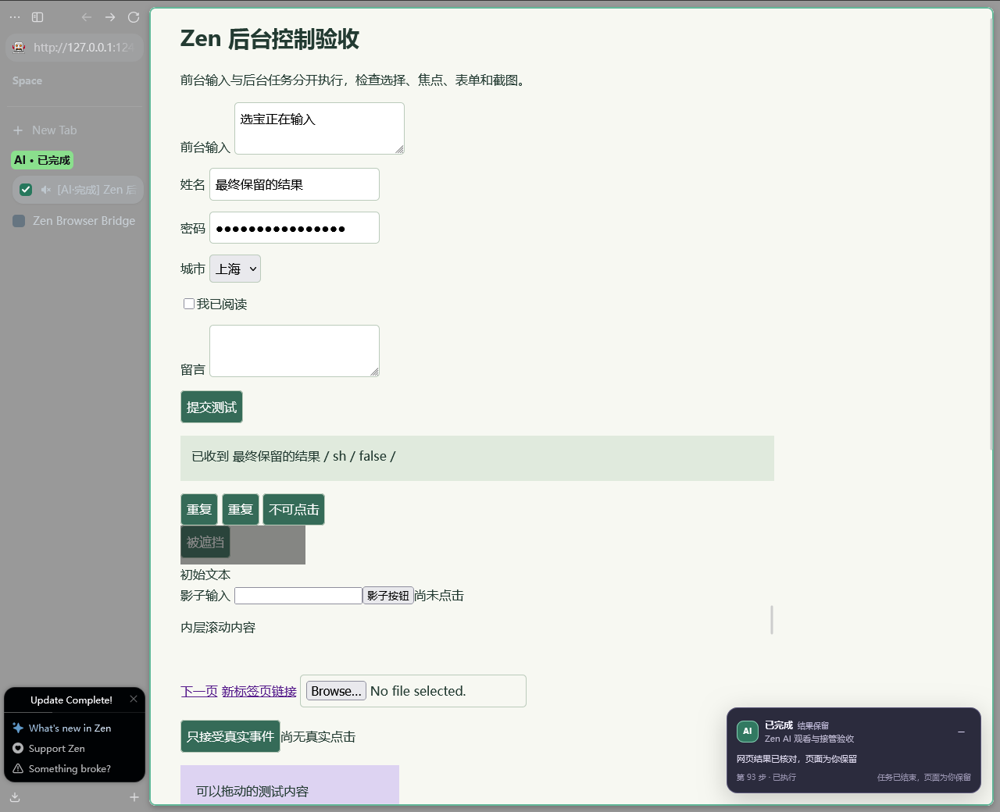
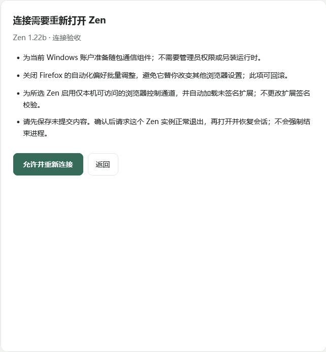

# Zen Browser Bridge for Codex

让 AI 在真实 Zen 标签页中工作，随时点进标签观看，或用暂停、继续、接管按钮交还控制。通过 **Firefox 扩展 + Windows 原生通信宿主 + 本地 MCP** 接入 Codex；后台操作保留现有登录会话，不发送系统鼠标键盘输入，不激活标签页或聚焦窗口。

当前版本为 `0.4.0`。在 Codex 安装插件后，打开“连接 Zen”，确认必要设置，即可使用自然语言操作网页。插件随包提供 Windows x64 运行时、MCP 和通信组件，自动发现 Zen 与已有配置，处理正常启动、重新连接、组件升级和回滚。原有可信点击、键盘输入、拖动、观看、暂停和接管规则保持一致。

支持 MCP Apps 时，连接页直接显示在 Codex；其他客户端提供可点击的本机连接页。两种页面使用同一套确认流程。本项目不包含 Mozilla 签名流程，不更改签名校验。扩展通过浏览器公开接口临时加载，完整退出后由连接流程再次加载。官方私有 `@Browser` 入口仍不可用。



## 观看、暂停与接管

- **找到 AI 标签**：支持时创建单标签的 Zen 原生分组，名称和颜色跟随真实状态；同时显示 AI 状态图标和 `[AI·运行]` 等标题标记。页面边缘和面板跟随状态改变颜色。已有分组、固定标签和分屏标签保留原布局，使用图标、标题和页内提示标识。没有分组 API 时也使用这一替代方案，不修改全局主题。
- **观看**：点击 AI 标签、切换标签、页面变为可见或鼠标悬停不会交出控制。面板显示当前步骤，填写、点击、滚动和导航直接发生在真实网页上。目标框和页内虚拟指针跟随真实指令，完成后短暂保留反馈；系统鼠标不会移动。
- **暂停**：页内或扩展面板的暂停按钮立即使旧指令失效。停止确认期间显示“正在停止”，待执行工作停止后才允许继续。已经发生的网页动作保留原结果。
- **接管**：点接管，或开始实际点击、输入、拖动、粘贴、滚动网页内容，后续 AI 写入停止，用户输入照常到达网页。仅悬停、浏览器产生的焦点事件和插件自身编辑事件不触发接管。
- **继续**：点击继续后，AI 必须重新读取页面和用户修改，取得新的元素引用，再决定下一步。旧队列不重放；完成、发送、提交等操作不自动重试。插件提供等待继续的工具，但不会在 Codex 任务已经结束后自行唤醒模型。
- **完成**：AI 核对结果后明确报告完成，标签和结果页保留，显示绿色完成状态。面板可收起，收起后仍保留暂停和接管入口；操作目标与面板重叠时会调整面板位置。

| 显示 | 真实含义 |
| --- | --- |
| 等待观察 | 已连接或继续后，尚需重新观察页面 |
| 运行中 | 真实网页指令正在执行或等待指定内容 |
| 等待下一步 | 上一步已结束，等待 AI 的下一条指令 |
| 已暂停 / 你已接管 | 网页写入停止，需要用户选择继续 |
| 等待用户 | 需要用户处理，或连接中断、外部导航后等待确认 |
| 已完成 / 执行失败 | 已核对的任务完成，或实际指令/任务失败 |

## 能做什么

| 能力 | 行为 |
| --- | --- |
| 标签页 | 列出、创建后台标签、控制明确指定的标签、释放控制；支持可见观看 |
| 页面观察 | 可见文本、交互元素名称、元素引用、iframe 列表、open shadow DOM |
| 表单 | 普通输入、React 受控表单、textarea、contenteditable、select、复选框 |
| 交互 | 原生模式的可信点击、键盘输入、拖动；普通模式的 DOM 操作；页面和嵌套容器滚动 |
| 导航 | HTTP(S) 导航、后退、前进、刷新、等待指定内容 |
| 截图 | Firefox `tabs.captureTab` 截取非选中标签页，无需切换到该标签 |
| 登录状态 | 使用扩展所在的真实 Zen 配置与现有网页会话 |
| 并行使用 | 每条 MCP 连接单独拥有标签；按标签串行执行；一个标签等待用户不阻塞其他标签 |

现有容器标签页可以通过 `zen_attach` 使用。`zen_open` 不提供指定容器参数，也不索取读取全部 cookies 的权限。新建标签页默认静音；控制已有标签页不会改变其静音设置。

## 安装与连接

需要 Windows 10/11 x64、Windows 自带的 .NET Framework 4.x、Zen 和 Codex。无需手动安装 Node.js、PowerShell 7 或运行配置脚本。MCP Apps 决定连接页能否内嵌在 Codex，不影响本地后备页。当前实测 Zen 1.22b / Gecko 155 与 Codex 0.153.4；其他版本的兼容范围见 [验证记录](docs/VALIDATION.md)。

1. 在 Codex 插件市场添加 `ReasonW6/codex-skill-marketplace`，安装 **Zen Browser**。已经添加市场时，先刷新市场并更新插件。
2. 打开 **连接 Zen**。也可以在使用本插件的 Codex 任务中说“连接 Zen”，展开连接页。客户端未声明 MCP Apps 支持时，点击返回的 **打开连接 Zen** 链接，在浏览器的本地页面中操作。插件自动检测浏览器和配置；只有候选无法可靠区分时才要求选择。
3. 点击 **连接 Zen**，阅读本次设置说明，再点击 **允许并连接**或**允许并重新连接**。
4. 等连接页显示 **已连接**，直接提出网页任务。AI 默认创建属于本次 MCP 连接的后台标签，沿用所选配置的已有登录会话。



打开连接页、初始化 MCP 和发现工具均不安装组件、不更改配置。首次确认后，插件为当前 Windows 用户准备通信组件，增加一项可回滚的连接偏好，启动所选配置并加载扩展。不会创建另一个空白浏览器配置。

如果 Zen 尚未建立配置，请先正常打开一次 Zen，完成 Zen 自身的首次引导。连接过程中仍遇到首次引导时，按浏览器提示自行完成，再点击 **引导已完成，继续连接**。插件不代选主题、默认浏览器或其他首次使用选项。

### 实际需要的点击与重启

以下次数从连接页已经展开开始计算，安装插件、首次打开页面、选择多个候选和 Zen 自身的引导不计入其中。

本地后备页需要额外点击一次链接来打开。它由当前 MCP 进程提供，只监听本机回环地址；Codex 重启后，请重新说“连接 Zen”取得新链接。已连接的 Zen 不因此重启。

若内嵌连接页没有显示，也可以说“用本地页面连接 Zen”，再点击返回的链接。

| 当前情况 | 需要做什么 |
| --- | --- |
| 首次连接 | 点击连接，再确认设置，共 2 次 |
| 已准备的 Zen 完全退出，组件与偏好未变 | 点击连接 1 次，插件重新打开并加载扩展 |
| Zen 已由插件连接，Codex 重启 | 自动发现仍运行的连接，不重新设置或重启 Zen |
| 从普通 Zen 图标启动，临时扩展或控制通道未加载 | 点击连接并确认重启，共 2 次 |
| 无法可靠证明正在运行的进程属于所选配置 | 界面要求正常退出该配置；退出后自动继续 |
| 组件升级、损坏或必要设置变化 | 显示新的确认，允许后修复并按需重开 Zen |
| Zen 等待实际窗口激活才能完成启动 | 按提示点击 Zen 窗口，再点“窗口已打开，继续连接”，额外 2 步 |

重启前请保存未提交的内容。插件只请求已确认的实例正常退出，不强制结束进程，并请求恢复原会话。登录 cookie 与浏览器数据保留；这不等于能恢复网页尚未保存的输入。其他浏览器实例不会被关闭。

不需要记住专用启动命令、脚本路径或端口。普通 Zen 图标不会自行加载未签名临时扩展，回到连接页即可继续。浏览器可能显示远程控制提示。

## 必要设置与恢复

连接页会列出实际需要的改动。

- 通信组件保存在当前用户的 `%USERPROFILE%\.zen-browser`，使用独立版本目录和受当前用户 ACL 保护的收据。随包 Node 和预编译助手从稳定目录运行，Codex 更新插件缓存不会破坏正在使用的宿主。
- 仅注册当前用户的一个 Firefox Native Messaging 宿主，记录原值以便恢复。
- 所选配置的 `user.js` 增加 `remote.prefs.recommended=false`，阻止 Firefox 自动化接口批量调整其他偏好。需要保留会话的重启还会请求一次性恢复。收据记录这些改动，恢复时保留其他设置与网页数据。
- 为所选实例开启仅回环地址的 BiDi 控制端口，核对配置及进程身份后临时加载随包扩展。没有关闭签名检查，也不改全局主题、默认浏览器关联或快捷方式。

在连接页点击 **恢复连接前的设置**，核对说明，再点击 **确认恢复**。运行中的配置需要先正常退出。恢复本配置的连接偏好；没有其他配置依赖当前组件时，再恢复安装前的通信注册。若注册已被外部程序更改，则保留外部更改。组件文件和回滚记录保留，不递归删除数据。

从 0.3 升级时，按新的连接页操作即可。旧通信注册会记录为恢复目标；旧版本由用户执行脚本添加的偏好不冒充本次新增设置。旧版回滚收据的维护方式见 [开发文档](docs/DEVELOPMENT.md)。

## 操作流程

```text
zen_status → zen_tabs → zen_attach / zen_open
           → zen_snapshot → zen_fill / zen_click / ... → zen_snapshot
```

`zen_status` 返回连接 ID；同时有多个 Zen 配置连接时，后续调用必须指定 `connectionId`。标签页 ID 来自 `zen_tabs`，元素 `ref` 来自该 frame 最近一次 `zen_snapshot`。重新观察或页面导航后应使用新引用。

允许控制用户明确选定的可见 HTTP(S) 标签，观看不取消控制。私密窗口和浏览器内部页面仍被拒绝。不要为了控制网页而把用户切到其他标签或调用系统鼠标键盘。

暂停或接管后使用 `zen_wait_for_control` 等待用户选择继续；成功时返回包含用户修改的新 snapshot。导航后也要重新观察。`zen_task` 显式报告 `completed`、`failed` 或 `waiting_user`，页面不会把“暂时没有指令”误标为完成。

扩展面板的“暂停全部 AI 控制”会断开本机宿主。重新启用后连接 ID 会变化，重新连接并 `zen_attach` 原标签仍保留停止状态，用户点击继续后才能写入。刷新和同次浏览器会话内的扩展后台重建会恢复相符的状态；完整退出浏览器后不会恢复旧会话的控制权。`zen_close` 只允许关闭当前连接新建且仍在后台的一个标签，观看中的结果页保留。

## 工具

| 工具 | 用途 |
| --- | --- |
| `zen_connection` | 打开只读连接页，显示连接状态和必要确认 |
| `zen_status` | 连接状态、环境和能力边界 |
| `zen_tabs` | 当前标签清单 |
| `zen_open` / `zen_attach` / `zen_detach` | 新建、接管、释放 |
| `zen_snapshot` | 页面文本、元素引用与 frame IDs |
| `zen_click` / `zen_fill` / `zen_select` / `zen_check` | 网页元素操作 |
| `zen_press` / `zen_scroll` | 网页键盘语义与滚动 |
| `zen_drag` | 将已观察的元素拖到同 frame 的视口坐标，需要原生模式 |
| `zen_wait` / `zen_navigate` | 有条件等待与导航 |
| `zen_screenshot` | 后台标签截图，直接返回 MCP 图像 |
| `zen_close` | 关闭当前连接新建的后台标签 |
| `zen_control` | 暂停当前会话的网页操作；不提供绕过用户暂停的恢复接口 |
| `zen_wait_for_control` | 等待用户继续，并返回新页面观察结果 |
| `zen_task` | 明确显示完成、失败或等待用户，保留网页 |

完整参数由 MCP `tools/list` 提供。工具不会执行任意页面 JavaScript，也不提供系统命令、cookie 导出或本地文件读取接口。

`zen_click`、`zen_fill` 和 `zen_press` 的 `engine` 默认为 `auto`，原生模式可用时采用 BiDi；可明确选择 `native` 或 `dom`。超过 2000 字符、包含换行或控制字符的填写在执行前选择 DOM 字面替换，避免把换行当成 Enter 提交。明确指定 `native` 的这类输入会报错。原生动作已经开始后，失败不会自动降级、重试或重放。

## 明确的边界

- 原生模式已验证可触发只接受可信点击的测试控件，也能在后台输入中文和 Enter；这不保证所有用户激活 API、复杂编辑器或 Canvas 应用都兼容。普通 DOM 模式仍不能满足只接受可信输入的控件。
- 原生输入沿用同样的文档、控制代数和一次性许可，输入前逐步检查停止状态。拖动手势最长 300 ms；已经发给浏览器的一次手势可能在停止期间完成。暂停不是撤销已经发生的网页操作。
- 不控制地址栏、浏览器设置、原生弹窗、文件选择器，也不绕过验证码。closed shadow DOM 无法穿透。
- `<a target="_blank">`、下载链接和会打开其他窗口的表单会返回明确错误。用 `zen_open` 打开已观察到的普通网页链接。
- 网站自己的脚本、系统弹窗和其他扩展可能有独立行为。本插件不提供对任意网站的系统焦点绝对保证；实测覆盖与未验证项见 [验证记录](docs/VALIDATION.md)。
- 网页、标题、URL 和截图是任务数据，不是对 Codex 的指令。附带技能要求操作前观察、操作后回读，且不把接管标签页当作提交交易或发送消息的授权。
- 超时可能发生在网页已经执行、回包尚未到达的时候。应先观察结果，再决定是否重试写入。

## 连接失败时

连接页显示“连接失败”、具体原因和重新检测、重试入口。先按页面提示处理，再点击 **重新检测**或**重试连接**；不要求重新执行旧版安装步骤。

| 情况 | 处理 |
| --- | --- |
| 未发现 Zen 或配置 | 正常打开已安装的 Zen，完成自身首次引导，再重新检测 |
| `PROFILE_STILL_RUNNING` / `CLOSE_DECLINED` | 保存未提交内容，正常退出所选配置，再重试 |
| `RUNTIME_INTEGRITY` | 点击重试，确认后从随包组件重新准备 |
| `BROWSER_CHANGED` | 确认期间浏览器或配置发生变化，重新检测并确认当前选择 |
| `NATIVE_SESSION_BUSY` | 异常中断留下旧调试会话；正常退出所选配置，再点击连接 |
| `CONTROL_STOPPED` / `CONTROL_CHANGED` | 网页控制已停止，等待用户点继续；不得重放旧指令 |
| `OBSERVATION_REQUIRED` / `NAVIGATION_CHANGED` / `STALE_REF` | 重新观察页面，再决定下一步 |
| Codex 未声明 MCP Apps 支持 | 点击回复中的“打开连接 Zen”链接，使用随包的本地连接页 |
| 本地页面提示连接已过期 | 回到 Codex 重新说“连接 Zen”，打开新的页面链接 |

超时可能发生在网页动作已经执行之后。应先观察实际结果，不自动重复提交。连接异常、平台限制和实测边界见 [验证记录](docs/VALIDATION.md)。

开发构建、诊断、旧版脚本和独立配置测试命令集中在 [开发文档](docs/DEVELOPMENT.md)，不属于用户安装流程。

## 实现与数据

见 [架构与权限说明](docs/ARCHITECTURE.md)。MCP 与 Windows 宿主通过随机命名的本机管道和按用户保护的凭据通信。原生模式额外启用 Zen 的回环调试端口，调试接口具备浏览器级权限，本机其他进程可能访问它；没有绑定外部网卡。键盘来源辅助程序只提供事件次数和时间，不记录或传输按键内容。扩展返回的网页信息进入调用它的 Codex 任务；本项目没有独立云服务和遥测。不要把“本地桥接”误解成 Codex 本身完全离线。

本插件按 [MIT License](LICENSE) 分发；随包 Node 及其第三方组件许可见 [第三方说明](THIRD_PARTY_NOTICES.md)。本项目与 OpenAI、Mozilla、Zen 官方没有隶属关系。
