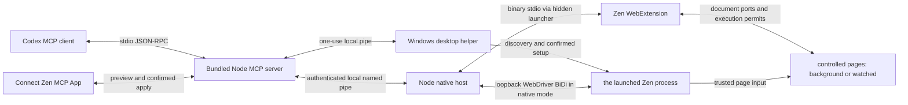

# 架构与权限

## 控制与取消

`server/mcp.mjs` 实现 MCP 的初始化、工具发现、工具调用、ping 和取消通知，支持 2024-11-05、2025-03-26、2025-06-18、2025-11-25 协议协商。所有工具参数经过类型、长度、范围和额外字段校验。页面错误返回 `isError`，不会伪装成功。

每个 native host 有新的随机连接 ID、管道名称及 256 位 token。连接发现文件在安装目录的 `connections/` 下，只返回给当前用户的 MCP 服务；`zen_status` 不包含 token 或管道地址。Windows 安装器为该目录设置独立 ACL。浏览器原生宿主清单只允许 `zen-browser@reasonw6.github.io` 连接。

宿主为每个管道客户端分配独立 session ID，并重新生成请求 ID。不同客户端重复使用请求 ID 也不会混淆回包。每个请求有队列期限和宿主超时；客户端关闭会取消在途指令并释放该连接拥有的标签。过期回包被忽略，工具提示观察实际状态后再重试。

扩展按标签串行执行网页操作；只读标签清单和暂停不排在长等待之后。不同标签可以独立处理，等待用户的标签不会阻塞其他标签。`control-state.js` 维护控制所有者、状态、控制代数、文档观察和真实步骤历史；标签是否可见只影响“后台 / 观看”提示，不决定控制权。

每条排队指令记录当前控制代数。暂停、接管、断线、恢复和文档导航会使旧代数失效；恢复时清空观察和元素引用，写入前必须读取新 snapshot。`zen_wait_for_control` 等待用户在界面选择继续并返回新观察，本身没有恢复权限。`zen_wait` 可以跟随预期导航，但不能跨过用户暂停后继续执行旧计划。

内容脚本在动作准备后、实际提交前向背景控制器申请一次性许可；控制器再次校验会话、代数、文档和观察记录，内容脚本收到许可后再次检查本地停止屏障。页内暂停先同步设置本地屏障，再通知所有 frame。界面在已派发工作停止确认前显示“正在停止”并禁用继续。已经开始的同步网页动作不能抢占或撤回；跨进程消息传递也不是事务回滚。超时结果不明时不自动重试写入。

`input-origin.js` 用插件自身事件 WeakSet、同步执行区间和具体输入特征共同判断来源。原生模式按当前一次性许可预先登记准确的键、编辑语义或 BiDi 指针坐标；普通物理指针 ID、其他键和外部编辑仍触发接管。`focus()`、可见性、悬停和插件编辑产生的浏览器事件不会仅因 `isTrusted` 而被当成人工输入。来源不明的浏览器编辑让控制进入等待用户，原始用户事件正常传递给网页。

同一个真实键和 BiDi 键仅凭页面事件可能无法区分。Windows `PhysicalInputProbe.cs` 使用被动键盘来源检测，为当前 Zen 前台窗口返回次数与时间戳；不记录、存储或传输键码和文字，也不发出系统输入。每个原生键盘步骤前检查计数，并同时核对受控文档的可见性、焦点和切入时间。用户在另一个标签或其他程序里输入时，后台 AI 可以继续；受控页面中检测到实际键盘输入则停止。辅助程序断开时原生键盘操作报错。

每个 frame 使用带文档 ID 的长连接。导航会主动失效旧连接和在途读取，避免把指令发到 BFCache 中仍保持端口但脚本已冻结的历史文档；恢复历史页面时重新建立通道并重新观察。同文档导航也会使观察过期。

`page-ui.js` 在 closed shadow root 内显示状态、页面边框与操作按钮，避免普通页面样式和元素扫描混入控制界面。真实目标带适度高亮，点击时显示页内虚拟指针；没有系统指针移动或额外演示动画。可见页面仅让出一次绘制机会，最长约 24 ms，完成高亮保留 550 ms 不阻塞下一条命令。原生标签组 API 可用且标签不在既有分组、固定或分屏布局时，创建单标签分组并更新颜色；图标和标题也跟随状态更新。状态标题变化去重，避免状态广播和标题观察互相触发。Zen 标签图标异步解码，最终状态由实机测试读取浏览器实际图标验证。

显示状态以同次浏览器会话内的 `storage.session` 保存，不恢复旧会话的执行许可。后台重建后未完成任务进入等待用户；原生连接恢复也需要重新连接目标并由用户继续。显式完成释放写入所有权、保留结果标签和完成标识。

## 原生输入和精确绑定

`server/native-driver.mjs` 在收到扩展已经准备、并取得一次性许可的请求后发送 BiDi 输入。native host 把反向请求绑定到正在等待的原 MCP 会话、标签和命令，每条指令仅可开始一次原生动作；暂停与客户端取消同步通知 driver。MCP 不暴露任意脚本执行、调试命令或端口转发。

内容脚本在自己的 closed shadow root 内保存随机文档 ID、控制代数和一次性 token。BiDi 在同 URL 候选文档中找到这个确切标记并绑定共享节点，每个输入步骤前再次读取节点连接状态和许可；URL 仅用于缩小候选范围，不能决定控制哪个标签。重复 URL、iframe 和已导航文档均有针对性测试。

`engine:auto` 对可用连接选择可信点击、键盘和拖动。大于 2000 字符或包含控制字符的填写在任何原生输入开始前选择 DOM 字面替换；明确原生模式则拒绝，避免换行变成提交。原生输入不自动重试，不会在已输入部分文本后降级重填。取消后释放该上下文的 BiDi 按键状态；已经派发的同步点击或最多 300 ms 的拖动手势不能回滚。停止屏障确认所有扩展和原生工作结束后才允许继续。

浏览器级 BiDi 会话使用一条连接。正常关闭最后一个浏览器窗口或暂停全部控制时结束原生会话；异常杀死宿主可能使浏览器留下旧会话，此时明确报告 `NATIVE_SESSION_BUSY`，通过正常关闭配置并重新启动恢复，不自动复用失去归属的动作。

## 连接页与本机操作

`server/connection-manager.mjs` 管理发现、用户选择、一次性确认、连接状态、重试和收据回滚。`profiles.ini` 中的配置与安装默认项是只读发现来源；依次考虑已确认的选择、唯一正在使用的配置和无歧义的默认配置。只有无法可靠区分候选时才要求选择。初始化、工具发现和连接页检测均不创建安装目录，不改配置或注册表。

`ui/connection.html` 是 `text/html;profile=mcp-app` 资源，使用 MCP Apps 的 JSON-RPC postMessage 与 Codex 通信。`zen_connection` 返回公开状态和仅供 UI 的 `_meta`。预览、确认、继续和取消工具声明 `visibility: ["app"]`；确认票据只通过 `_meta` 交给 UI，一次使用、五分钟有效。确认后再次核对配置目录清单、文件锁、进程开始时间、浏览器路径和原生宿主注册；改变就要求重新确认。

工具可见性与 `_meta` 隔离由支持 MCP Apps 的宿主实现，不是针对恶意本机 MCP 客户端的独立安全边界。当前 Codex 的全局、设置和任务入口元数据经过本地代码核实，实际后端和 UI 资源经过集成测试；桌面外壳本身的点击验证范围见验收文档。

客户端未声明 MCP Apps 时，`zen_connection` 启动仅监听 `127.0.0.1` 的临时连接页，并返回可点击链接。`server/connection-page.mjs` 复用相同 HTML 和 `invokeConnectionTool`，不复制另一套设置逻辑。初始化和工具发现不启动这个 HTTP 服务；打开链接前后都不写配置。页面通过每次随机生成的 256 位路径、严格 Host/Origin 校验、请求类型与大小限制隔离请求；只允许连接工具，不转发网页操作。CSP 限制脚本及 frame 来源，禁止跨站嵌套主页面，不加载远程资源，不发送 Referer。进程结束关闭服务，浏览器连接保持独立。

UI 显示未连接、连接中、已连接和连接失败。确认页支持键盘焦点隔离、Escape 返回、窄屏及深浅色；异步检测的旧结果不会覆盖新选择。停止等待不会强杀浏览器或删除已经准备的文件。首次引导由用户在 Zen 完成；遇到窗口未激活导致启动握手等待时，页面要求用户点击 Zen 窗口，再继续连接。不会把这种路径标成零交互启动。

## Windows 桌面与稳定运行时

`.mcp.json` 让 Codex 从插件根目录执行 `./runtime/node.exe server/mcp.mjs`。Node 24.21.0 Windows x64、三个预编译 .NET Framework 助手及许可证随包提供；用户不下载运行时、不运行 PowerShell 或编译器。

`server/windows.mjs` 创建随机命名本机管道和 256 位 nonce，再让原生助手通过标准 Explorer 桌面激活方式启动自身的单次工作进程。工作进程先证明 nonce，随后才接收一条有界 JSON 请求。检测不落地请求文件；注册、检查、回滚和浏览器启动使用与 Zen 一致的桌面注册表视图。这修复了打包 Codex 子进程与正常浏览器可能看到不同 HKCU 值的问题，无需修改系统的虚拟化或安全设置。

配置清单、连接偏好、首次引导状态和会话文件状态也由该只读桌面进程读取，MCP 不依赖自己的 AppData 视图来判断实际 Zen 配置。确认后会重新核对连接偏好；发生改变时要求重新确认。

分发助手只允许激活自己的可执行文件，不接受任意命令。操作层仅支持已实现的动作和固定宿主名；正常用户检查拒绝专用沙盒账户。当前用户级连接互斥锁串行化准备流程，桌面操作还有独立的设置互斥锁，确保 Codex 退出时尚未结束的操作不会与下次设置同时写入。

安装先校验随包文件，随后在 `%USERPROFILE%\.zen-browser` 写准备收据和独立版本目录。目录 ACL 限当前用户、SYSTEM 与管理员。程序记录原生注册旧值、复制文件哈希、版本和前一版收据。即使复制中断，仍有可识别的准备记录用于重试；不会覆盖归属不明的非空目录。使用用户目录中的稳定位置，也避免打包应用与桌面的 AppData 文件虚拟化差异。

`scripts/NativeLauncher.cs` 是原生通信的无窗口启动器，将长度前缀二进制 JSON stdin/stdout 与固定 Node 子进程互相转发，不使用 cmd.exe 或字符串命令求值。中文、空格和百分号路径经过测试。宿主和网页控制保持原有的管道认证与文档许可规则。

## 浏览器启动、退出与恢复

用户确认后，必要时通过 Windows Restart Manager 请求精确 PID 与创建时间对应的实例正常退出，从不使用 RmForceShutdown。不能证明进程与所选配置的关联，或浏览器没有完成退出时，连接页等待用户正常退出。旧实例和配置锁均释放后才能继续；仅文件锁暂时可用不等于实例已彻底结束。

配置准备仅为所选 `user.js` 追加带唯一标记的 `remote.prefs.recommended=false`，防止 Remote Agent 批量调整其他偏好。需要保留会话时，在 `prefs.js` 请求一次性恢复并记录原值。恢复移除本次标记块，恢复所记录偏好，同时保留无关的用户修改；不会改主题、签名校验、默认浏览器或快捷方式。

`server/launch-zen.mjs` 使用 `--new-instance --profile` 打开同一配置，分配回环控制端口，核对 BiDi 返回的配置、进程 ID、二进制和父进程，再用 `webExtension.install` 临时加载随包扩展。桌面激活使浏览器不属于 Codex MCP 的关闭即终止进程树；关闭 Codex 只结束控制客户端，不结束 Zen。

已准备配置完全退出后，连接页自动负责再次启动和加载，不要求用户记住专用命令。普通 Zen 图标仍是普通启动方式，未加载的控制通道需要经过新的重启确认。临时扩展不是永久安装。完整退出清除旧控制会话，新 MCP 连接不能重用原有写入许可。

受保护的启动记录通过 `ZEN_BROWSER_LAUNCH` 传给该实例和其 native host。driver 拒绝其他目录、外部主机和其他配置。原生端口仍是高权限浏览器调试接口，本机其他进程可能访问；插件自己的管道认证不为该端口添加额外认证。没有启用 `--remote-allow-system-access`。

回滚使用当前安装收据并核对当前注册，必要时沿同一安装的升级收据链恢复原值；若注册已被外部程序更改则保留外部更改。多个配置仍依赖宿主时保留通信注册。宿主文件、浏览器数据和收据不递归删除。旧版手动脚本和旧收据的边界见 [开发文档](DEVELOPMENT.md)。

## 权限用途

| 扩展权限 | 用途 |
| --- | --- |
| `nativeMessaging` | 启动受允许的本机宿主并收发消息 |
| `tabs` | 读取标签元数据、后台创建、导航、有限关闭 |
| `tabGroups` | 为适用的受控标签创建和更新原生状态分组 |
| `storage` | 保存连接是否启用，以及同次浏览器会话内的显示状态 |
| `webNavigation` | 返回 iframe ID 并定向操作 iframe |
| `<all_urls>` | 注入已接管网页的内容脚本，以及 Firefox 后台截图 |

没有全局 content_scripts 自动注入；只有已接管的指定标签被注入。没有 `externally_connectable` 或 web-accessible resources，也没有网页转发到 native host 的消息接口。扩展管理消息只接受自身扩展 URL 的发送者。

不索取 cookies、下载管理、剪贴板、代理或浏览历史权限。密码输入框值在结构化 snapshot 和 fill 返回中被遮蔽，但其他网页正文和截图仍是用户所请求的页面内容，可能含有敏感信息。

## 平台与能力差异

本实现使用公开 Firefox WebExtension 和 WebDriver BiDi API，不借用官方 Chrome 扩展 ID，不调用 OpenAI 私有浏览器协议。普通模式不启用调试端口；原生模式仅针对用户在连接页明确确认的配置启用 BiDi。实际验收全部使用独立配置，日常浏览器配置没有被修改。

原生模式已测试后台可信点击、中文键盘输入、Enter 和拖动，但不保证所有网站的用户激活能力。原生对话框、浏览器内部页面、closed shadow DOM、文件上传等能力未实现。原生组的外观由 Zen 决定，不能通过普通扩展任意定制。当前版本不声明完整官方插件等价性。

## 参考依据

- [OpenAI 插件打包](https://developers.openai.com/plugins/build/plugins)
- [Codex MCP 插件配置解析源码](https://github.com/openai/codex/blob/rust-v0.153.4/codex-rs/codex-mcp/src/plugin_config.rs)，相对 `cwd` 在插件根目录下解析。
- [OpenAI MCP Apps UI 文档](https://developers.openai.com/plugins/build/chatgpt-ui)
- [Codex Windows MCP 进程生命周期](https://github.com/openai/codex/blob/rust-v0.153.4/codex-rs/rmcp-client/src/stdio_server_launcher.rs)
- [Microsoft 从桌面激活进程的标准模式](https://devblogs.microsoft.com/oldnewthing/20131118-00/?p=2643)
- [Mozilla Native Messaging](https://developer.mozilla.org/en-US/docs/Mozilla/Add-ons/WebExtensions/Native_messaging)
- [Firefox tabs.captureTab](https://developer.mozilla.org/en-US/docs/Mozilla/Add-ons/WebExtensions/API/tabs/captureTab)
- [Firefox tabs.create](https://developer.mozilla.org/en-US/docs/Mozilla/Add-ons/WebExtensions/API/tabs/create)
- [Firefox tabs.group](https://developer.mozilla.org/en-US/docs/Mozilla/Add-ons/WebExtensions/API/tabs/group)，分组会移动相邻标签并可能解除固定，因此保留用户既有分组、固定和分屏布局。
- [Firefox tabGroups.update](https://developer.mozilla.org/en-US/docs/Mozilla/Add-ons/WebExtensions/API/tabGroups/update)，用于原生分组标题和颜色。
- [Firefox storage.session](https://developer.mozilla.org/en-US/docs/Mozilla/Add-ons/WebExtensions/API/storage/session)，仅保存同次浏览器会话内的显示记录。
- [WebDriver BiDi input.performActions](https://developer.mozilla.org/en-US/docs/Web/WebDriver/Reference/BiDi/Modules/input/performActions)
- [WebDriver BiDi webExtension.install](https://developer.mozilla.org/en-US/docs/Web/WebDriver/Reference/BiDi/Modules/webExtension/install)
- [Zen 扩展说明](https://docs.zen-browser.app/user-manual/extensions)

这些资料说明所使用的公开接口；具体可用行为以测试报告为准。
