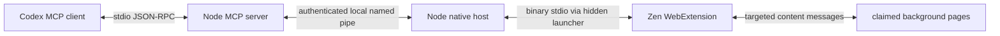

# 架构与权限

## 控制与取消

`server/mcp.mjs` 实现 MCP 的初始化、工具发现、工具调用、ping 和取消通知，支持 2024-11-05、2025-03-26、2025-06-18、2025-11-25 协议协商。所有工具参数经过类型、长度、范围和额外字段校验。页面错误返回 `isError`，不会伪装成功。

每个 native host 有新的随机连接 ID、管道名称及 256 位 token。连接发现文件在安装目录的 `connections/` 下，只返回给当前用户的 MCP 服务；`zen_status` 不包含 token 或管道地址。Windows 安装器为该目录设置独立 ACL。浏览器原生宿主清单只允许 `zen-browser@reasonw6.github.io` 连接。

宿主为每个管道客户端分配独立 session ID，并重新生成请求 ID。不同客户端重复使用请求 ID 也不会混淆回包。每个请求有队列期限和宿主超时；客户端关闭会取消在途指令并释放该连接拥有的标签。过期回包被忽略，工具提示观察实际状态后再重试。

扩展串行执行收到的操作，避免同一页面上的异步操作相互穿插。在每个异步操作边界重新检查控制权。内容脚本在执行前检查 `document.hidden`，覆盖 Zen 分屏中“未选中但仍可见”的页面。用户切换到受控标签会立即删除其控制记录，不会自动切走用户或恢复旧控制。

这里的取消是尽力阻止尚未执行的操作；已经同步执行的网页动作不能撤回。宿主超时不能证明网页没有执行该动作。

## Windows 启动器

Firefox Native Messaging 使用长度前缀的二进制 JSON。`scripts/NativeLauncher.cs` 是很小的无窗口启动器，把原生 stdin/stdout 与 Node 子进程的二进制流互相转发，每次写入后刷新，不等待缓冲区填满。它不使用 `cmd.exe` 或字符串命令求值，支持中文、空格、百分号路径。

安装时用 Windows 自带的 .NET Framework 编译器生成启动器；程序和浏览器 XPI 均未做代码签名。安装器只写当前用户的一个 Native Messaging 注册项，记录前值及具体路径；卸载脚本只恢复匹配的本次注册，保留文件。

## 权限用途

| 扩展权限 | 用途 |
| --- | --- |
| `nativeMessaging` | 启动受允许的本机宿主并收发消息 |
| `tabs` | 读取标签元数据、后台创建、导航、有限关闭 |
| `storage` | 保存连接是否启用 |
| `webNavigation` | 返回 iframe ID 并定向操作 iframe |
| `<all_urls>` | 注入已接管网页的内容脚本，以及 Firefox 后台截图 |

没有全局 content_scripts 自动注入；只有已接管的指定标签被注入。没有 `externally_connectable` 或 web-accessible resources，也没有网页转发到 native host 的消息接口。扩展管理消息只接受自身扩展 URL 的发送者。

不索取 cookies、下载管理、剪贴板、代理或浏览历史权限。密码输入框值在结构化 snapshot 和 fill 返回中被遮蔽，但其他网页正文和截图仍是用户所请求的页面内容，可能含有敏感信息。

## 平台与能力差异

本实现使用公开 Firefox WebExtension API，不借用官方 Chrome 扩展 ID，不调用 OpenAI 私有浏览器协议，也不向当前浏览器开启远程调试。仅隔离实机测试使用 Marionette，以便布置测试网页、模拟前台输入、读取实际选中标签并安装临时测试扩展。

DOM 合成点击/按键与 Chromium 调试协议的真实输入有差异。用户激活、原生对话框、浏览器内部页面、closed shadow DOM、文件上传等能力未实现。当前版本不声明完整官方插件等价性。

## 参考依据

- [OpenAI 插件打包](https://developers.openai.com/plugins/build/plugins)
- [Codex MCP 插件配置解析源码](https://github.com/openai/codex/blob/main/codex-rs/codex-mcp/src/plugin_config.rs)，相对 `cwd` 在插件根目录下解析。
- [Mozilla Native Messaging](https://developer.mozilla.org/en-US/docs/Mozilla/Add-ons/WebExtensions/Native_messaging)
- [Firefox tabs.captureTab](https://developer.mozilla.org/en-US/docs/Mozilla/Add-ons/WebExtensions/API/tabs/captureTab)
- [Firefox tabs.create](https://developer.mozilla.org/en-US/docs/Mozilla/Add-ons/WebExtensions/API/tabs/create)
- [Zen 扩展说明](https://docs.zen-browser.app/user-manual/extensions)

这些资料说明所使用的公开接口；具体可用行为以测试报告为准。
