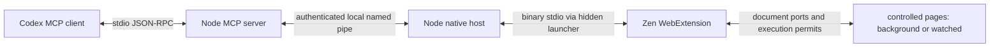

# 架构与权限

## 控制与取消

`server/mcp.mjs` 实现 MCP 的初始化、工具发现、工具调用、ping 和取消通知，支持 2024-11-05、2025-03-26、2025-06-18、2025-11-25 协议协商。所有工具参数经过类型、长度、范围和额外字段校验。页面错误返回 `isError`，不会伪装成功。

每个 native host 有新的随机连接 ID、管道名称及 256 位 token。连接发现文件在安装目录的 `connections/` 下，只返回给当前用户的 MCP 服务；`zen_status` 不包含 token 或管道地址。Windows 安装器为该目录设置独立 ACL。浏览器原生宿主清单只允许 `zen-browser@reasonw6.github.io` 连接。

宿主为每个管道客户端分配独立 session ID，并重新生成请求 ID。不同客户端重复使用请求 ID 也不会混淆回包。每个请求有队列期限和宿主超时；客户端关闭会取消在途指令并释放该连接拥有的标签。过期回包被忽略，工具提示观察实际状态后再重试。

扩展按标签串行执行网页操作；只读标签清单和暂停不排在长等待之后。不同标签可以独立处理，等待用户的标签不会阻塞其他标签。`control-state.js` 维护控制所有者、状态、控制代数、文档观察和真实步骤历史；标签是否可见只影响“后台 / 观看”提示，不决定控制权。

每条排队指令记录当前控制代数。暂停、接管、断线、恢复和文档导航会使旧代数失效；恢复时清空观察和元素引用，写入前必须读取新 snapshot。`zen_wait_for_control` 等待用户在界面选择继续并返回新观察，本身没有恢复权限。`zen_wait` 可以跟随预期导航，但不能跨过用户暂停后继续执行旧计划。

内容脚本在动作准备后、实际提交前向背景控制器申请一次性许可；控制器再次校验会话、代数、文档和观察记录，内容脚本收到许可后再次检查本地停止屏障。页内暂停先同步设置本地屏障，再通知所有 frame。界面在已派发工作停止确认前显示“正在停止”并禁用继续。已经开始的同步网页动作不能抢占或撤回；跨进程消息传递也不是事务回滚。超时结果不明时不自动重试写入。

`input-origin.js` 用插件自身事件 WeakSet、同步执行区间、物理指针/键盘/滚轮意图以及近期输入序列共同判断来源。物理输入即使出现在操作区间内也触发接管；`focus()`、可见性、悬停和插件编辑产生的浏览器事件不会仅因 `isTrusted` 而被当成人工输入。来源不明的浏览器编辑让控制进入等待用户，避免覆盖用户修改。原始用户事件正常传递给网页。

每个 frame 使用带文档 ID 的长连接。导航会主动失效旧连接和在途读取，避免把指令发到 BFCache 中仍保持端口但脚本已冻结的历史文档；恢复历史页面时重新建立通道并重新观察。同文档导航也会使观察过期。

`page-ui.js` 在 closed shadow root 内显示状态与操作按钮，避免普通页面样式和元素扫描混入控制界面。真实目标带适度高亮，点击时显示页内虚拟指针；没有系统指针移动或额外演示动画。可见页面仅让出一次绘制机会，最长约 24 ms，完成高亮保留 550 ms 不阻塞下一条命令。原生标签组 API 可用且标签不在既有分组、固定或分屏布局时，创建单标签分组并更新颜色；其他情况下使用标题标识。状态标题变化去重，避免状态广播和标题观察互相触发。

显示状态以同次浏览器会话内的 `storage.session` 保存，不恢复旧会话的执行许可。后台重建后未完成任务进入等待用户；原生连接恢复也需要重新连接目标并由用户继续。显式完成释放写入所有权、保留结果标签和完成标识。

## Windows 启动器

Firefox Native Messaging 使用长度前缀的二进制 JSON。`scripts/NativeLauncher.cs` 是很小的无窗口启动器，把原生 stdin/stdout 与 Node 子进程的二进制流互相转发，每次写入后刷新，不等待缓冲区填满。它不使用 `cmd.exe` 或字符串命令求值，支持中文、空格、百分号路径。

安装时用 Windows 自带的 .NET Framework 编译器生成启动器；程序和浏览器 XPI 均未做代码签名。安装器只写当前用户的一个 Native Messaging 注册项，记录前值及具体路径；卸载脚本只恢复匹配的本次注册，保留文件。

## 权限用途

| 扩展权限 | 用途 |
| --- | --- |
| `nativeMessaging` | 启动受允许的本机宿主并收发消息 |
| `tabs` | 读取标签元数据、后台创建、导航、有限关闭 |
| `tabGroups` | 为适用的受控标签创建和更新原生状态分组 |
| `storage` | 保存连接是否启用，以及同次浏览器会话内的显示状态 |
| `webNavigation` | 返回 iframe ID 并定向操作 iframe |
| `<all_urls>` | 注入已接管网页的内容脚本，以及 Firefox 后台截图 |

没有全局 content_scripts 自动注入；只有已接管的指定标签被注入。没有 `externally_connectable` 或 web-accessible resources，也没有网页转发到 native host 的消息接口。扩展管理消息只接受自身扩展 URL 的发送者。

不索取 cookies、下载管理、剪贴板、代理或浏览历史权限。密码输入框值在结构化 snapshot 和 fill 返回中被遮蔽，但其他网页正文和截图仍是用户所请求的页面内容，可能含有敏感信息。

## 平台与能力差异

本实现使用公开 Firefox WebExtension API，不借用官方 Chrome 扩展 ID，不调用 OpenAI 私有浏览器协议，也不向当前浏览器开启远程调试。仅隔离实机测试使用 Marionette，以便布置测试网页、模拟前台输入、读取实际选中标签并安装临时测试扩展。

DOM 合成点击/按键与 Chromium 调试协议的真实输入有差异。用户激活、原生对话框、浏览器内部页面、closed shadow DOM、文件上传等能力未实现。当前版本不声明完整官方插件等价性。

## 参考依据

- [OpenAI 插件打包](https://developers.openai.com/plugins/build/plugins)
- [Codex MCP 插件配置解析源码](https://github.com/openai/codex/blob/main/codex-rs/codex-mcp/src/plugin_config.rs)，相对 `cwd` 在插件根目录下解析。
- [Mozilla Native Messaging](https://developer.mozilla.org/en-US/docs/Mozilla/Add-ons/WebExtensions/Native_messaging)
- [Firefox tabs.captureTab](https://developer.mozilla.org/en-US/docs/Mozilla/Add-ons/WebExtensions/API/tabs/captureTab)
- [Firefox tabs.create](https://developer.mozilla.org/en-US/docs/Mozilla/Add-ons/WebExtensions/API/tabs/create)
- [Firefox tabs.group](https://developer.mozilla.org/en-US/docs/Mozilla/Add-ons/WebExtensions/API/tabs/group)，分组会移动相邻标签并可能解除固定，因此保留用户既有分组、固定和分屏布局。
- [Firefox tabGroups.update](https://developer.mozilla.org/en-US/docs/Mozilla/Add-ons/WebExtensions/API/tabGroups/update)，用于原生分组标题和颜色。
- [Firefox storage.session](https://developer.mozilla.org/en-US/docs/Mozilla/Add-ons/WebExtensions/API/storage/session)，仅保存同次浏览器会话内的显示记录。
- [Zen 扩展说明](https://docs.zen-browser.app/user-manual/extensions)

这些资料说明所使用的公开接口；具体可用行为以测试报告为准。
