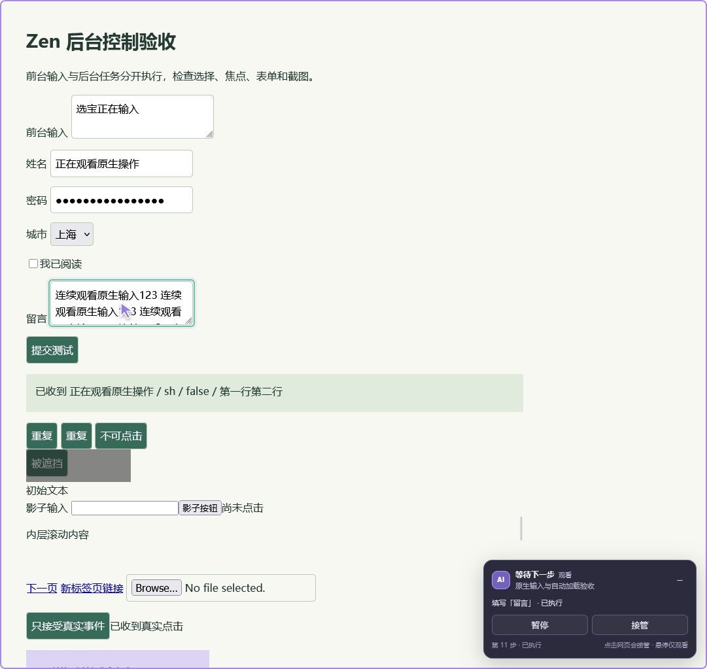
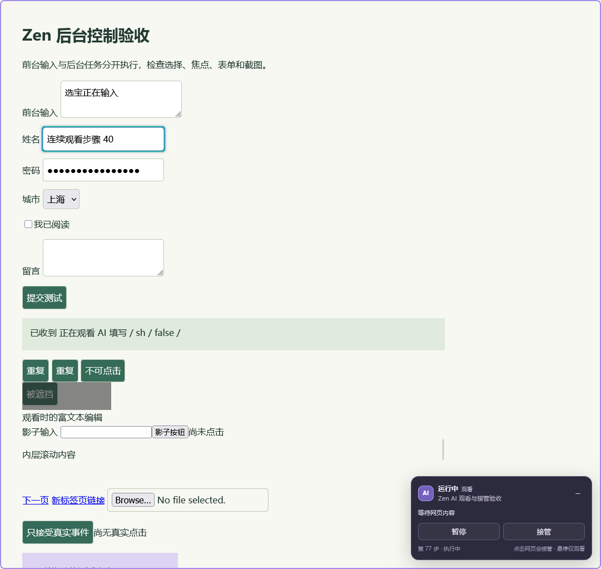
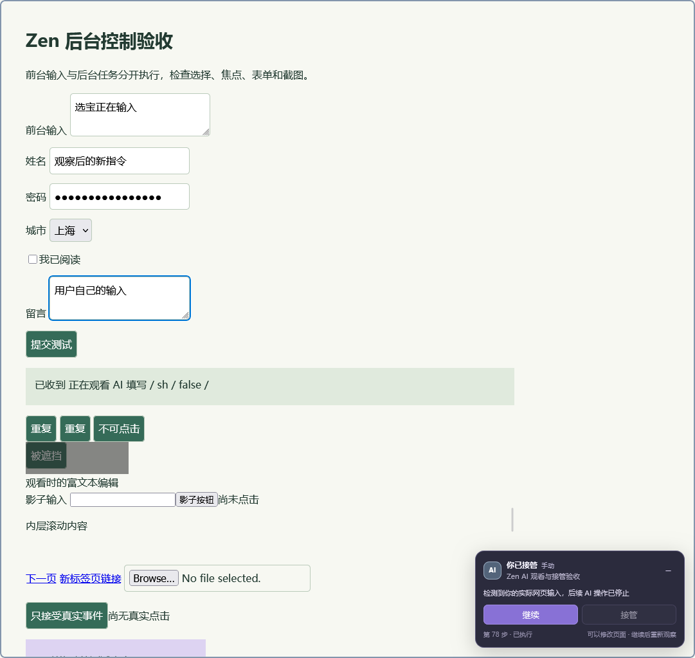

# Zen Browser 0.3.0 验证记录

2026-09-10，在 Windows 上使用实际安装的 **Zen 1.22b / Gecko 155** 和 Node.js 24.13.1 完成测试。全部实机流程使用全新独立配置、真实 Native Messaging 宿主和实际 MCP 客户端；日常 Zen 配置没有被修改。

## 最终检查结果

| 检查 | 结果 |
| --- | --- |
| Node 单元、控制状态、原生输入、输入归因、配置回滚、MCP 和真实管道测试 | 55 / 55 通过 |
| 语法和 JSON | 34 个文件通过 |
| 带窗口的原有 Zen 集成流程 | 57 / 57 通过 |
| 配套启动器和真实 BiDi 输入集成流程 | 25 / 25 通过 |
| Windows 前台窗口采样 | 普通模式后台 35 次、观看 28 次；原生模式后台 16 次、观看 20 次；99 次在各自阶段保持同一非空窗口 |
| Mozilla web-ext 10.6.0 lint | 0 errors / 0 warnings / 0 notices |
| Codex 插件与技能清单校验 | 通过 |
| 项目锁文件依赖审计 | 0 vulnerabilities；运行时无第三方 npm 依赖 |
| 两套测试的 Native Messaging 注册回滚 | 成功 |

机器可读检查清单、环境与源码 SHA-256 见 [validation.json](validation.json)。Windows/Linux CI 另行验证源码、协议和打包，不能替代这些实际浏览器流程。

## 本版新增验收

- 从生产启动器自动临时加载未签名扩展，发现全部 20 个 MCP 工具及真实原生模式能力。
- 实际 MCP 点击触发只接受可信事件的网页控件；普通 DOM 模式对应测试确认不会触发该控件。
- 原生模式在后台真实输入中文、替换内容和 Enter 提交，前台标签的焦点、文本、选区及 Windows 前台窗口保持正确。
- 点击受控标签进入观看，原生点击、连续输入和 Enter 继续执行，没有被自身可信事件误判为接管。
- 多行填写按字面替换，不把换行变成 Enter，也不会意外提交表单。
- 同 URL 的不同标签不会混淆；原生输入绑定到确切 iframe 文档。
- 原生长文本输入中暂停，剩余字符停止；紧接着继续也不重放旧队列，重新读取页面后才能开始新操作。
- 实际网页输入触发接管，原生拖动正确到达目标；第二条 MCP 连接不能操作已被其他连接拥有的标签。
- 明确完成后保留真实结果页面。标签组、标题、页面边框、面板和浏览器实际 favicon 都显示完成。
- 关闭浏览器后使用同一个配置和启动器重启，扩展自动加载；原有 HttpOnly 登录 cookie 保留，新的原生操作能够继续工作。
- 配置脚本默认预览不写文件；显式设置和收据回滚经过测试，恢复原 user.js 字节并保留无关的后续 prefs.js 修改。

## 保留的流程验收

原有 57 项流程覆盖普通及 React 受控表单、checkbox、select、textarea、contenteditable、DOM Enter、open shadow DOM、跨源 iframe 和后台截图；验证前台持续输入、观看、悬停、暂停、点击/键盘/拖动接管、继续后重新观察、动态标题、导航与历史后退、刷新恢复控制面板、断线重连与会话隔离。被遮挡、禁用、文件输入、新窗口链接和过期引用仍被拒绝。

界面状态来自实际指令和结果，真实等待时显示运行中，真实错误时显示失败。收起后保留暂停和接管入口；控制按钮不混入页面元素观察；任务完成保留结果。测试安装路径包含中文、空格和百分号。

## 实机截图

以下截图来自实际测试命令和结果。原生输入截图中的“已收到真实点击”由测试网页核对事件可信性后显示。

## 结论的范围

这些检查证明列出的流程，**不代表与官方 Chrome 插件在所有网站和原生界面上完全等同**。

- 原生组样式遵循 Zen；图标和页面边框是普通扩展可实现的状态提示。官方私有 @Browser 入口、浏览器内部 UI、原生文件选择器、文件上传和 closed shadow DOM 未提供。
- 原生输入的自动加载要求每次使用配套启动器。普通 Zen 图标不会自动加载临时扩展。XPI 和 Windows 程序仍为 NotSigned；项目没有 Mozilla 签名流程，没有更改签名检查。
- 原生模式使用只绑定回环地址的高权限浏览器调试接口。测试没有访问用户日常配置；正式使用需明确选择配置并完成一项可回滚设置，详见 [安装说明](../README.md)。
- 原有 DOM 集成测试通过隔离配置中的 Marionette 布置测试、注入人工输入和读取浏览器 UI。原生测试通过生产 MCP → 扩展 → native driver → BiDi 路径执行动作；测试专用观察宿主共享该 BiDi 连接读取证据，扩展的测试副本仅增设选择标签和关闭窗口入口。这些测试入口不会作为生产接口启用。
- 页面实际点击和键盘接管使用浏览器自动化输入模拟；Windows 被动键盘来源探针运行过，但没有安排真实人工在原生输入的同一瞬间按下相同字符，因此不把这一竞争场景称为已人工验证。
- 暂停阻止后续操作，已派发的一次点击或最长 300 ms 的拖动不能回滚。未知结果不自动重试；异常结束宿主后可能需要正常重启该配置来释放旧 BiDi 会话。
- 未测试实际支付、发帖、邮件发送等对外提交，也不保证任意网页脚本、原生弹窗和第三方扩展都不会改变系统焦点。
- 继续按钮能唤醒正在等待的 MCP 调用，不能在 Codex 任务结束后自行开启新的模型回合。

视觉复查时发现早期截图拍在 favicon 异步更新完成前。补充断言起初没有解码 Zen 的 moz-remote-image/Base64 封装，导致测试误报；修正测试解析并等待实际图标更新后通过，未为此更改生产逻辑。失败样本没有并入最终通过结果。

web-ext 的版本检查提示本机更新配置目录不可写，但扩展 lint 成功；没有更改该目录权限。具体源码、许可校验和数据流见 [架构说明](ARCHITECTURE.md)。
