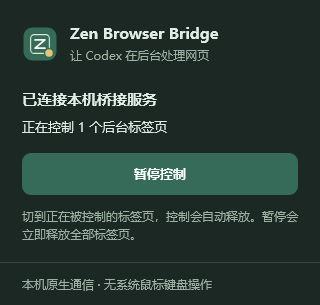
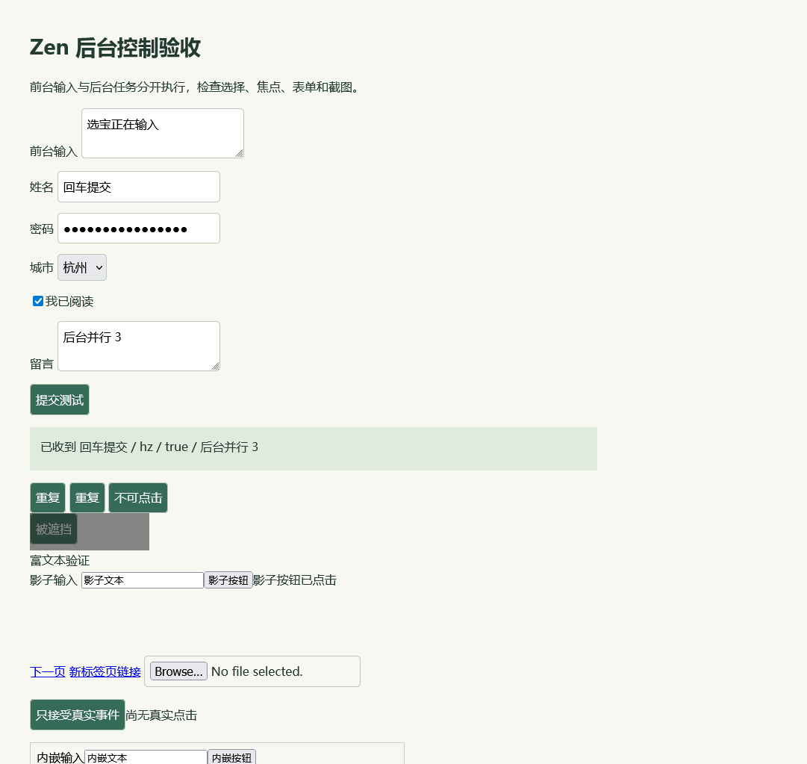

# Zen Browser 0.1.0 验证记录

2026-09-09，在 Windows 上使用实际安装的 **Zen 1.22b / Gecko 155.0.1** 完成测试。Node.js 为 24.13.1。使用全新独立配置与临时扩展，日常 Zen 配置没有被修改。

## 最终检查结果

| 检查 | 结果 |
| --- | --- |
| Node 单元、MCP 和真实管道协议测试 | 19 / 19 通过 |
| 带窗口的实际 Zen 集成流程 | 37 / 37 通过 |
| Windows 前台窗口采样 | 68 次，全部为同一个非空窗口句柄 |
| Mozilla `web-ext 10.6.0 lint` | 0 errors / 0 warnings / 0 notices |
| Codex 插件与技能清单校验 | 通过 |
| 项目锁文件依赖审计 | 0 vulnerabilities；运行时无第三方 npm 依赖 |
| 测试用 Native Messaging 注册回滚 | 成功 |

第一次系统窗口采样曾返回空句柄，该次采样被判为无效，没有作为前台保护证据。激活普通应用窗口后重新运行，最终 68 次非空采样通过。机器可读结果见 [validation.json](validation.json)。

## 实机覆盖

- 从 `.mcp.json` 中的真实启动配置启动 MCP 服务，发现全部 16 个工具。
- Zen 临时加载真实 WebExtension，通过 Windows 注册的 native host 完成通信。
- 新建非选中、静音标签页；使用现有浏览器会话的测试 HttpOnly cookie。
- 前台输入框保持 DOM 焦点、文本和选区；前台输入与后台填写同时进行时，输入互不串入。
- 普通表单、React 19.2.8 受控表单、checkbox、select、textarea、contenteditable、Enter 提交。
- open shadow DOM 和跨源 iframe 的读取、定位、填写、点击；Firefox 超过 32 位的 frame ID。
- 页面和嵌套容器滚动；后台 PNG 截图具有正确文件签名并经过视觉检查。
- 导航、后退、前进、刷新、有条件等待，以及导航期间的临时空白文档。
- 模糊定位、旧引用、禁用或被遮挡元素、打开新窗口的链接、文件输入框返回明确错误。
- 其他 MCP 连接不能接管同一标签；用户切回标签后写入被拒绝，切走也不自动恢复控制。
- 标签接管不会授予关闭既有标签的权限。
- 扩展面板显示真实连接状态，暂停断开宿主，恢复生成新连接 ID，原标签保持存在且失去旧控制权。
- 原生启动器和注册路径包含中文、空格、百分号，完整链路通过。

## 协议覆盖

二进制 Native Messaging 测试覆盖 UTF-8 多字节字符、分片/合并消息、消息长度限制。真实本机管道测试覆盖错误 token 拒绝、客户端身份隔离、重复请求 ID、超时取消、断线释放和过期回包丢弃。MCP 测试覆盖初始化、工具发现、参数拒绝、错误回包、图像内容及畸形 JSON 后的恢复。

## 结论的边界

这些检查证明了列出的后台网页流程，不代表任意网站和全部官方浏览器能力都可用。

- `isTrusted` 专用测试确认 DOM 合成点击不会触发仅接受真实事件的业务行为，这项能力明确不支持。
- 未验证真实支付、发帖、邮件发送或其他对外提交；集成测试使用本机测试页面与测试数据。
- 没有获取 Mozilla 扩展签名或 Windows Authenticode 签名。当前浏览器 XPI 是开发包，临时加载在退出 Zen 后失效。
- 没有官方 `@Browser` UI 集成、系统原生弹窗、浏览器内部页面、文件上传或 closed shadow DOM 控制。
- 网站自己发起的弹窗、其他扩展和系统弹窗有独立行为；采样证明的是本次测试场景下的系统焦点保持。

`web-ext` 在验证时单独运行，未打包或加入项目锁文件。其上游工具链当时有 `image-size`、`adm-zip` 相关依赖告警；因此这里的零漏洞结论仅指本项目锁文件和运行时，不泛指所有外部测试工具。

GitHub Actions 在 Windows/Linux 上运行源代码、协议和打包检查；远端 CI 不会冒充在用户机器上进行的上述实机验收。
