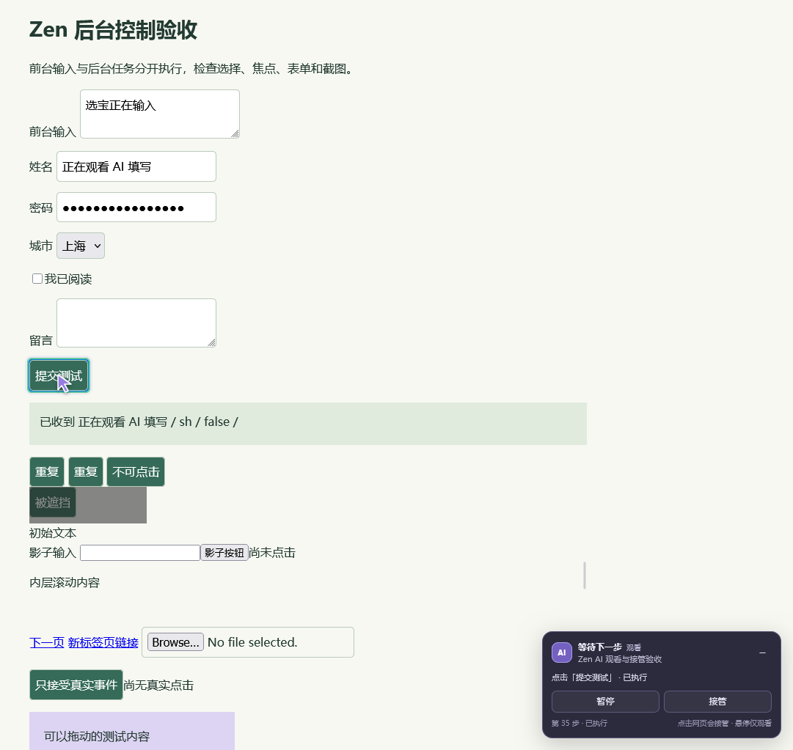

# Zen Browser 0.2.0 验证记录

2026-09-09，在 Windows 上使用实际安装的 **Zen 1.22b / Gecko 155** 和 Node.js 24.13.1 完成测试。实机流程使用全新独立配置、临时 WebExtension、真实 Native Messaging 宿主和实际 MCP stdio 客户端；日常 Zen 配置没有被修改。

## 最终检查结果

| 检查 | 结果 |
| --- | --- |
| Node 单元、控制状态、输入归因、MCP 和真实管道协议测试 | 37 / 37 通过 |
| 带窗口的实际 Zen 集成流程 | 56 / 56 通过 |
| Windows 前台窗口采样 | 后台阶段 27 次、观看阶段 32 次，59 次均为同一个非空窗口 |
| Mozilla `web-ext 10.6.0 lint` | 0 errors / 0 warnings / 0 notices |
| Codex 插件与技能清单校验 | 通过 |
| 项目锁文件依赖审计 | 0 vulnerabilities；运行时无第三方 npm 依赖 |
| 测试用 Native Messaging 注册回滚 | 成功 |

机器可读结果与源码 SHA-256 见 [validation.json](validation.json)。功能测试通过后，新增了冻结历史文档端口和标题状态去重的回归测试，两项均通过。

早期带窗口流程发现导航后旧 BFCache 文档的端口仍存在，后续读取可能被送往被冻结的旧文档。修正为导航时主动废弃旧通道及在途读取，并重新建立新页面通道；最终导航、刷新和后退流程通过。另一次观看阶段只有 10 个有效窗口样本，未达到预设的至少 11 个样本，因此未计为焦点通过；增加真实连续操作后，最终采样满足要求。没有把失败或无效采样并入最终通过结果。

## 已验证的交互

- 真实加载扩展，从随包 `.mcp.json` 启动服务并发现全部 19 个工具，完成本机认证管道通信。
- 新建后台标签保持非选中，原生 Zen 分组与页面标题显示对应状态。
- 普通表单、React 受控表单、checkbox、select、textarea、contenteditable、Enter 提交、open shadow DOM 和跨源 iframe 的实际读取、填写与点击。
- 后台工作时，另一个标签的焦点、文本、选区保持正确；前台输入与后台填写互不串入。
- 使用同一测试浏览器现有 HttpOnly 登录 cookie，不复制用户配置或读取全部 cookies。
- 点击 AI 标签后继续观看；悬停不接管，连续 40 次实际填写没有误判接管。
- 页内状态来自实际指令：真实等待期间显示运行中，真实错误显示失败，需要用户操作和完成分别由明确结果驱动。
- 目标高亮和虚拟指针与实际点击对应，截图中保留真实填写与提交结果。
- 面板使用 closed shadow root，控制按钮不会混入页面元素观察；收起后暂停和接管仍可用。
- 暂停中止正在等待的指令；暂停后立即继续也不会执行此前排队的写入。
- 继续前强制重新观察，等待继续的 MCP 调用被唤醒后得到用户修改后的 snapshot。
- 鼠标点击、键盘输入、实际拖动以及跨源 iframe 输入触发接管；原始输入仍交给网页。
- 动态网页标题保留原文字，同时显示 AI 标记。刷新保留暂停并重建控制面板。
- 导航与历史后退重新建立文档通道和观察；旧引用、禁用、遮挡、另开窗口及文件输入目标仍被明确拒绝。
- 第二条 MCP 连接不能操作已属于其他连接的观看标签；全局暂停、Native Messaging 重连和重新 attach 不会绕过停止状态。
- 明确完成后保留实际结果页，页内状态、标题和 Zen 原生分组都显示完成。
- 安装路径包含中文、空格和百分号，测试结束恢复专用测试宿主注册。

## 实机截图

截图来自上述实际指令和结果，没有演示数据叠加。

## 控制与协议覆盖

单元测试覆盖观看时保留控制、观察前拒绝写入、暂停使准备中的许可失效、恢复不重放旧队列、重新 attach 不绕过接管、显式完成保留页面、失败不自动重试、连接中断、跨会话隔离、等待继续、独立标签队列、导航通道失效以及标题去重。

输入来源测试覆盖插件标记事件、同步浏览器编辑事件、真实指针和键盘意图、粘贴、组合输入、滚轮、拖动，以及焦点、可见性和悬停不触发接管。二进制协议测试覆盖 UTF-8、分片/合并、大小边界；真实管道测试覆盖认证、客户端隔离、取消与超时；MCP 测试覆盖初始化、工具发现、参数错误、图像和畸形 JSON 恢复。

## 结论的范围

这些检查证明列出的后台、观看和接管流程，**不代表与官方 Chrome 插件在所有网页、原生外观和输入能力上完全等同**。

- 原生标签组的标题和颜色由 Firefox API 提供；其呈现遵循 Zen 当前样式，不是官方 Chrome 插件的专属标签边框。既有分组、固定或分屏布局用标题与页内面板替代。
- 真实输入测试由独立测试配置中的 Marionette 产生，不使用系统鼠标。正式插件仅使用 WebExtension API，没有给用户日常配置启用调试接口。
- 暂停阻止后续写入；已开始的同步动作和跨进程在途消息没有事务回滚能力。界面在停止确认前不允许继续，结果不明时不自动重复提交。
- 专门测试确认，DOM 合成点击不会完成只接受真实事件的页面行为。原生弹窗、地址栏、文件上传、closed shadow DOM 和官方 `@Browser` 入口仍未提供。
- 未测试真实支付、发帖、邮件发送等对外提交；网页内容均为本机测试页面和测试数据。系统焦点结论限于本次有采样的场景。
- XPI 和 Windows 启动器没有签名，当前仍是开发包；临时扩展在完全退出 Zen 后失效。没有更改签名校验、全局主题或用户浏览器配置。
- “继续”可以唤醒正在等待的 MCP 调用，但不能在 Codex 任务已结束后自行发起新的模型回合。

`web-ext` 单独运行，未加入项目锁文件。其版本检查提示本机更新配置目录不可写，但扩展 lint 本身成功；未按该提示更改用户目录权限。GitHub Actions 的 Windows/Linux 检查负责源码、协议与打包，不替代上述实机验收。
