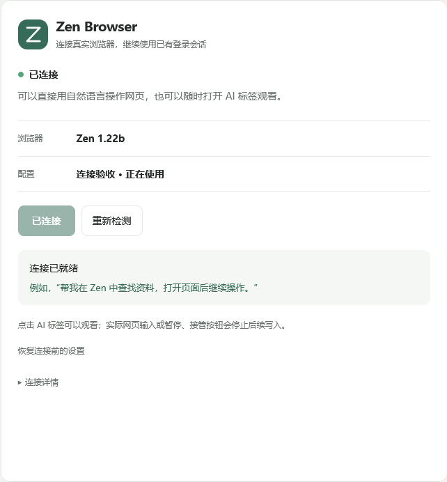
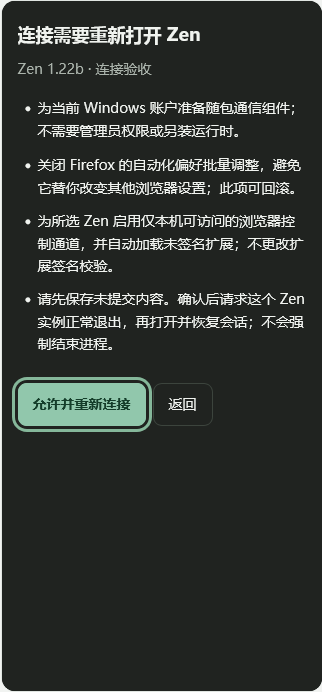
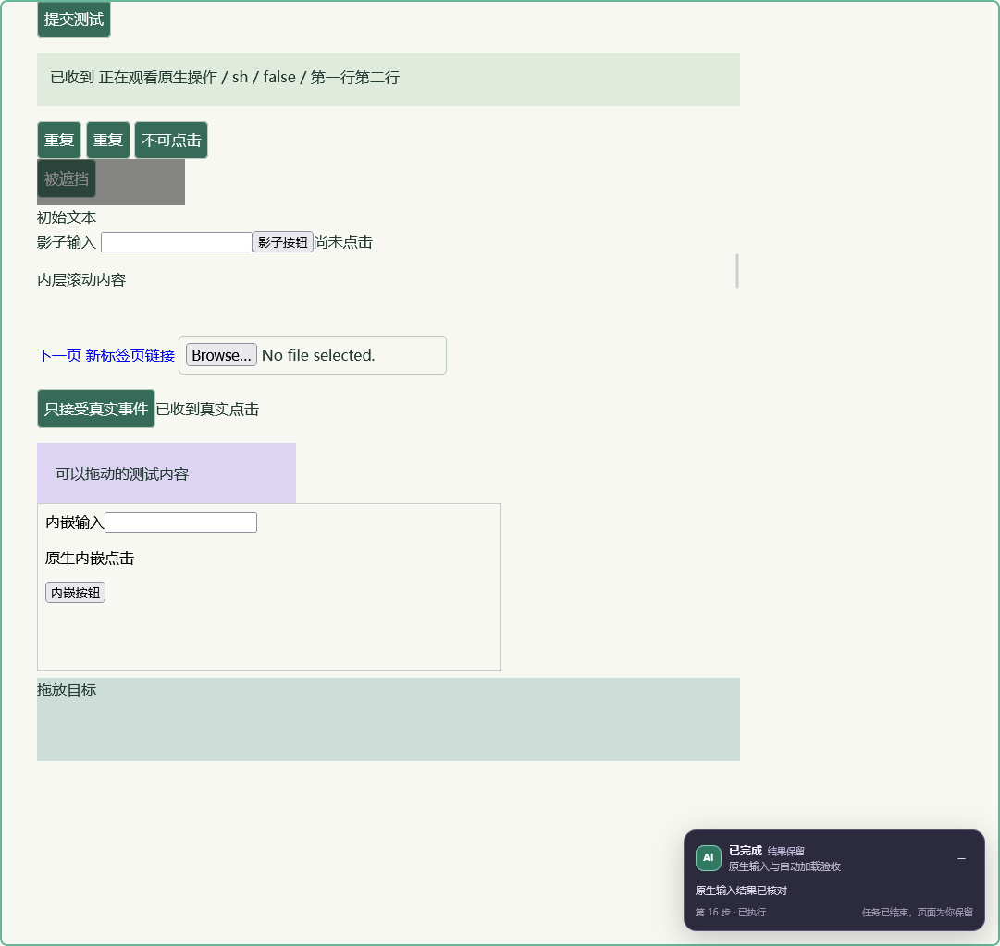

# Zen Browser 0.4.0 验证记录

2026-09-11，在 Windows x64、Zen 1.22b / Gecko 155.0.1 和实际 Codex 0.153.4 上完成验收。产品随包使用 Node.js 24.21.0。所有浏览器流程使用独立测试配置；日常 Zen 实例保留，测试注册和配置按收据恢复。

## 检查结果

| 检查 | 结果 |
| --- | --- |
| 单元、协议、控制状态、原生输入、配置及本地连接页测试 | 78 / 78，通过且无跳过 |
| 语法、JSON、随包运行时与助手源码哈希 | 45 个文件及运行时校验通过 |
| 真实 Codex 后端与 MCP App 连接页流程 | 34 / 34 |
| 实际 Codex 关闭 MCP Apps 后的本地连接页流程 | 35 / 35 |
| 全新配置、真实 Zen 首次引导与首次连接 | 16 / 16，记录了操作人员动作 |
| 原有带窗口 DOM 浏览器回归 | 57 / 57 |
| 真实 BiDi 输入与浏览器重启回归 | 25 / 25，重启时有一次窗口激活确认 |
| Windows 前台采样 | DOM 后台 45、观看 69；原生后台 37、观看 22，共 173 次在各自阶段保持同一非空窗口 |
| Mozilla web-ext 10.6.0 | 0 errors / 0 warnings / 0 notices |
| 依赖审计 | 0 vulnerabilities；运行时无第三方 npm 依赖 |
| 插件、技能清单校验 | 通过 |

[机器可读记录](validation.json) 包含逐项检查、方法、必要确认与源码 SHA-256。原始日志、测试收据和截图保留在本地 `.artifacts/`，不放入 Git 或发布包。Windows/Linux CI 验证源码、协议与包完整性，不能代替实际浏览器流程。

## 首次安装与连接

安装验收使用独立 Codex 主目录和测试市场，调用实际 Codex CLI 安装随包插件，再由实际 app-server 启动 `.mcp.json`。MCP 的 PATH 仅含 Windows System32，全局 Node.js 和 PowerShell 7 命令不可见。界面初始化、工具发现、首次预览均未创建通信安装目录或改变 profile 的 user.js；确认后才准备随包运行时和预编译助手。

已有配置场景先布置一个完成过 Zen 自身设置的独立浏览器、普通标签和真实 HttpOnly 测试会话，再正常退出并移除测试调试设置。首次插件连接之前没有桥接扩展、原生宿主或控制通道。随后普通启动该配置，由连接页显示重启说明并确认正常退出，恢复原标签，创建同一窗口内属于 AI 的后台标签，验证原登录会话和可信中文输入。

这证明首次安装插件到可用连接的流程，不把浏览器本身的初始化准备算作插件已经替用户完成。

## 全新 Zen 引导

另一条验收从空配置目录开始，测试建立 profiles.ini 配置项，模拟已经有配置项但尚未完成 Zen 引导的状态。实际 Zen 首次引导由 Computer Use 操作人员模拟完成。保留“不导入”“不设为默认浏览器”和默认搜索选择，未选新主题，跳过预置网站。插件等待完成后才继续，随后可信网页输入和 Codex 重启重连成功。

本次向导共有 7 次有效点击，另有连接页的连接、确认及引导完成后三次点击，合计 10 次。测试中一次无效的辅助功能索引点击、确认页键盘与视觉 QA 不属于用户正常流程，原始记录另行说明。没有将 Computer Use 模拟称为真实人工执行。

如果 Zen 从未运行、还没有配置项，产品先提示用户正常打开一次 Zen。它不会私自建立一个新的空白日常配置。

## 日常重连、修复与恢复

MCP App 和本地页面两条完整流程均验证了完全退出后的再次连接、从普通图标方式启动后的确认重启，以及关闭 Codex 后 Zen 仍运行、重新启动 Codex后识别同一连接。页面检测到损坏的隔离安装文件后显示 RUNTIME_INTEGRITY；点击重试并确认后重新准备组件，不要求手动脚本。

升级测试通过实际 Codex 安装一个仅用于验收的 0.4.1 包，检测仍运行的旧扩展，确认后使用新的稳定目录加载新版本。随后通过界面回滚，恢复最初 user.js 和安装前的宿主注册。两个无默认项、未在运行的配置会要求用户选择，不猜测目标。

原生回归中，一次浏览器重启等待实际窗口激活。操作人员核对测试窗口后激活它，再确认继续，后续会话和原生输入通过。这个场景额外需要“点 Zen 窗口”和“继续连接”两步，不算零交互启动。程序没有通过模拟系统输入替用户激活窗口。

## 界面与平台范围

内嵌页使用实际 Codex app-server、实际 MCP 响应和随包 HTML，在独立浏览器容器中执行；全局、设置和任务入口元数据由当前 Codex 桌面代码核实。没有自动点击 Codex 桌面外壳，也没有声称复刻官方私有浏览器入口。

本地后备页则由产品自己的 MCP 进程提供，实测关闭 `enable_mcp_apps` 且不声明客户端 UI 能力，直接打开 MCP 返回的本地链接。它复用同一确认界面并完成完整流程；不是测试容器冒充产品连接窗口。它在浏览器中显示，和内嵌在 Codex 的界面位置不同。Codex 重启后需要重新取得页面链接，已连接的 Zen 不因此重启。

确认弹层、Tab 焦点限制、Escape 返回、320px 窄屏和深色主题均通过真实 DOM 和渲染检查。本地 HTTP 页另外测试 Host/Origin、随机访问路径、类型、长度限制及只允许连接工具。

## 原有操作的保留

DOM 回归覆盖普通及 React 受控表单、checkbox、select、textarea、contenteditable、Enter、open shadow DOM、跨源 iframe、后台截图及现有会话。观看、悬停、前台持续输入、暂停、实际网页点击/键盘/拖动接管、继续后的新观察、动态标题、导航与刷新、断线、连接隔离、错误状态、完成结果与原生 favicon/分组均通过。

原生回归通过产品 MCP → 扩展 → 宿主 → BiDi 路径执行可信点击、中文键盘输入、Enter、拖动和 iframe 操作。重复 URL 不会混淆目标；多行文本不会误触 Enter；长输入中暂停会停止剩余字符，继续不重放旧队列。原生输入后，前台文本、选区和 Windows 焦点保持正确。

## 仍然存在的边界

- 当前包是 Windows x64，其他系统与其他 Zen 版本未做实机验收。
- MCP Apps 取决于客户端；本地页面是后备方案。某些启动需要用户激活窗口。
- 未签名扩展由公开接口临时加载，不是永久安装；普通 Zen 启动可能需要确认一次重启。没有 Mozilla 签名流程或关闭签名校验。
- ZIP、XPI 和自编译 Windows 助手是 NotSigned；随包的官方 Node 可执行文件保留有效 OpenJS Authenticode 签名，不能把整包说成已签名。
- 本版恢复自己记录的改动；0.3 用户手工设置的偏好及旧收据继续按旧版边界处理。
- 不提供官方私有 @Browser、浏览器内部 UI、原生文件选择器、文件上传或 closed shadow DOM 操作。
- 仅回环地址的 BiDi 仍具备浏览器级调试权限，本机其他进程可能访问它。
- 已派发的同步点击或最长 300ms 手势不能撤回；未知结果不自动重复提交。
- 未安排人工在原生输入的同一瞬间按下完全相同字符，也未测试真实支付、邮件或发帖等对外事务。
- 继续按钮只恢复正在等待的调用，不能在 Codex 任务结束后自行启动新模型回合。

早期失败记录用于修复注册表视图、进程生命周期、空起始页判断、窗口激活和测试等待时序，未计入通过数字。web-ext 的自身更新提示本机配置目录不可写，但扩展 lint 成功；没有为消除提示而修改系统权限。
